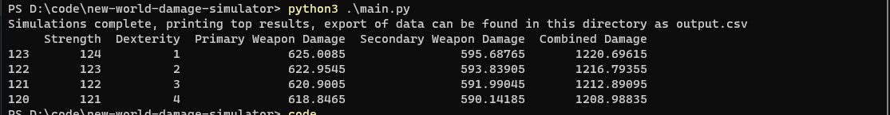
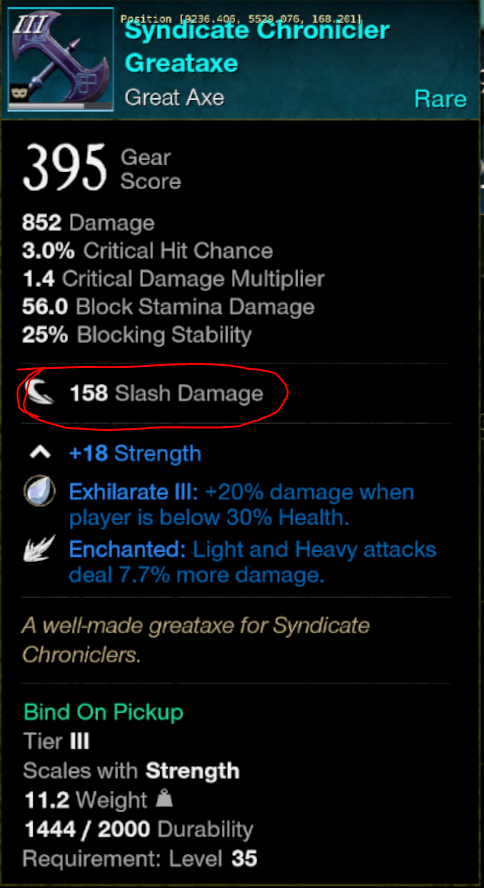

# New World Damage Simulator

A tool designed to take a characters base stats including armor and weapons, level, and base damage of their items (slash damage, blunt damage, etc) to simulate every combination of Attribute point assignments and report back the one with the highest combined weapon damage.

Example Output:


## Usage
open up your [config](config.json) and modify the "base_stats" object to match your character after clicking respec in your attribute points menu. Modify the "character" object to match your level and weapon selection/base damage, example of base damage below:



Lastly, if you would like to offset the simulations by a certain amount of points to increase your constitution, update the app_settings > desired_ap_to_constitution variable.

now simply (with Python 3.9 installed):
```bash
git clone https://github.com/Misterguruman/new-world-damage-simulator.git 
cd new-world-damage-simulator/
python3 -m pip install -r requirements.txt
python3 ./main.py
```
